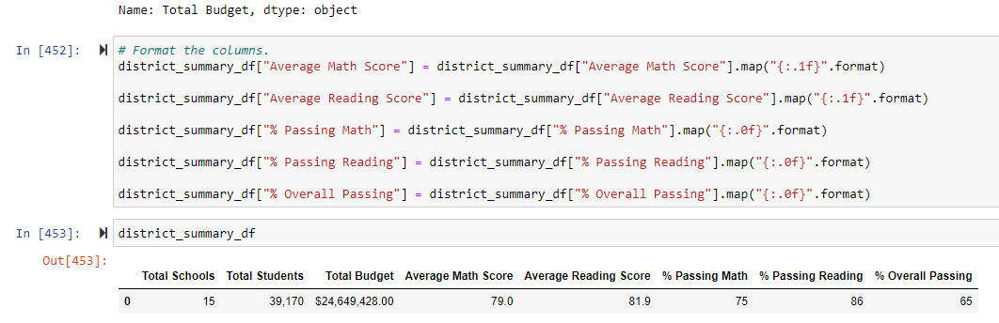
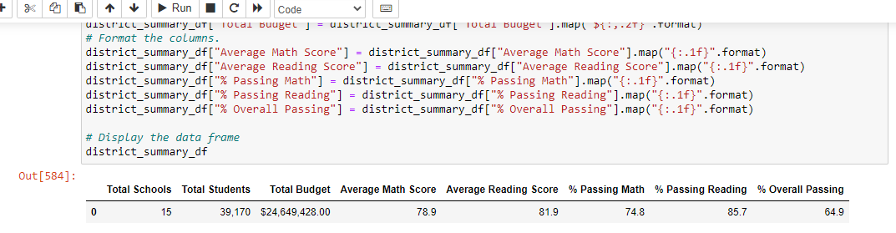
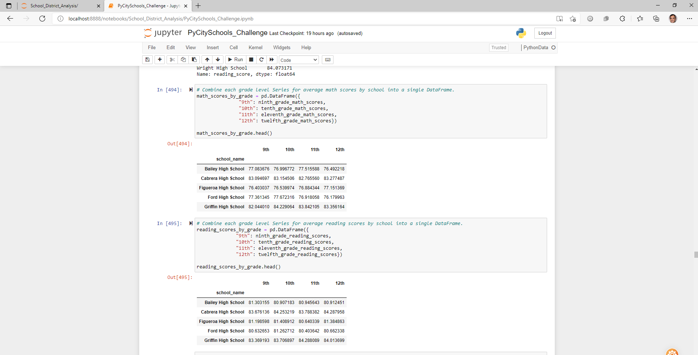
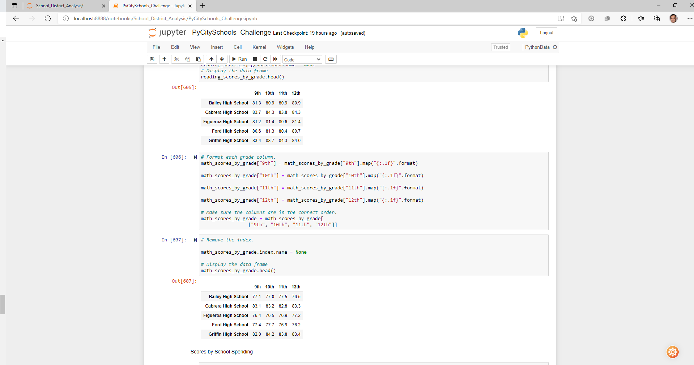
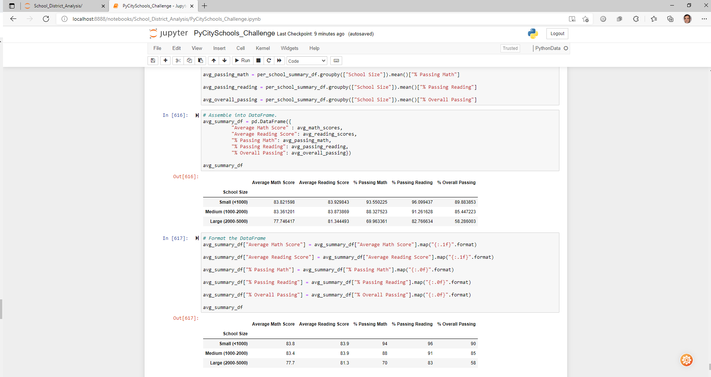
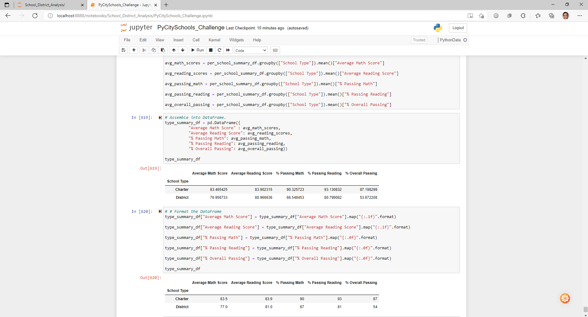

## Project Name: School_District_Analysis(Pandas-Using python for data analysis)

## Project: A Written Report for the School District Analysis

## Project Owner: Nayan Patel

##  Overview of School District Analysis: 

To find evidence of academic dishonesty; specifically, reading and math grades for Thomas High School ninth graders appear to have been altered. Although the school board does not know the full extent of the academic dishonesty, they want to uphold state-testing standards after cleaning data and repeating analysis

## Project Findings and Corrections and Measures used:

1. The district summary

2. The school summary

3. The top 5 and bottom 5 performing schools, based on the overall passing rate

4. The average math score for each grade level from each school

5. The average reading score for each grade level from each school

6. The scores by school spending per student, by school size, and by school type

## Results:

1. How is district summary affected:

## Data: Original before cleanup:	

•	Average Math Score = 79.0

•	Average Reading Score = 81.9

•	% Passing Math 75

•	% Passing Reading 86

•	% Overall Passing 65

 
 
 
## Data: After Cleanup

•	Average Math Score = 78.9

•	Average Reading Score = 81.9

•	% Passing Math 74.8

•	% Passing Reading 85.7

•	% Overall Passing 64.9

## Summary:
1. Overall results affeccted for math from 75% to 74.8% and for reading 86% to 85.7% Overall % has not much effect but still changes from 65% to 64.9%.

2. Original Math and reading scores by grade:

3.After Cleanup Math and reading scores by grade;

4. Scores by School Size:

5.Scores by type:

